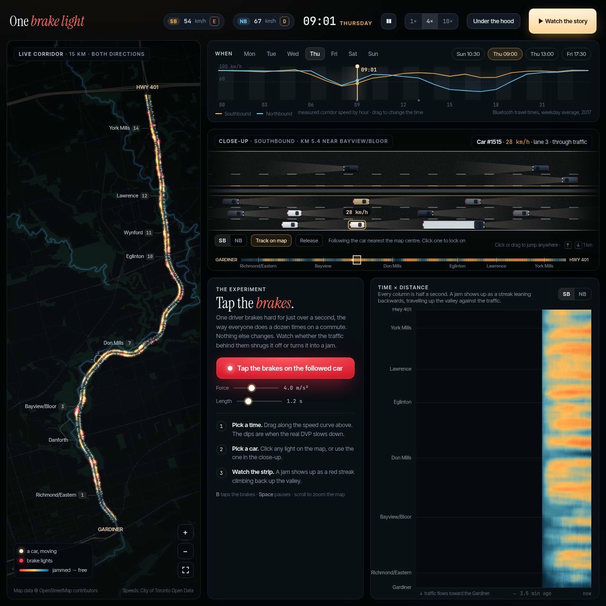
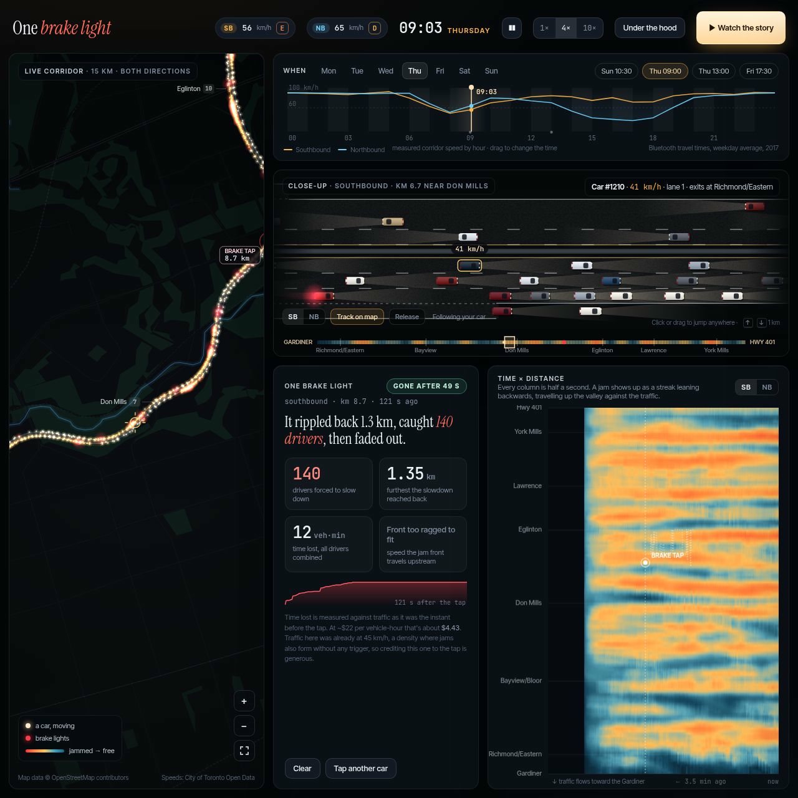
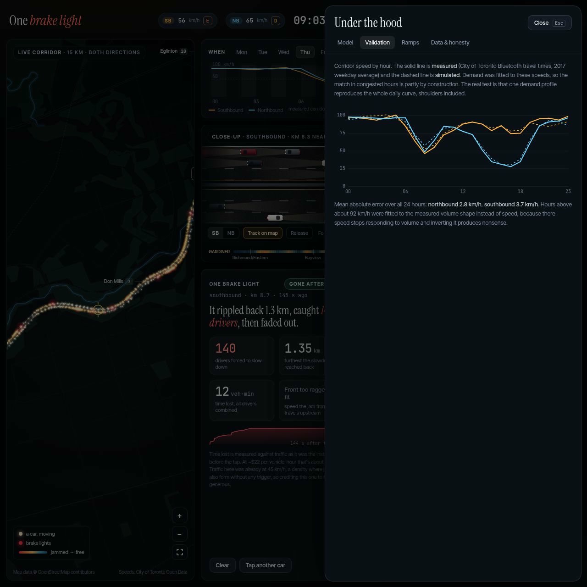

# One brake light

**A live, vehicle-by-vehicle simulation of Toronto's Don Valley Parkway, from Hwy 401 to the Gardiner, built to answer one question: what happens when a single driver taps the brakes?**

To run it, download `index.html` and open it in a browser. It is one self-contained file with no build step, server or API keys. Press **▶ Watch the story** for a narrated 90-second demo. It taps the same 1.2-second brake on a Sunday morning, where the traffic absorbs it, and on a Thursday at 9:00 a.m., where it cascades into a multi-kilometre jam.



<table><tr>
<td width="50%"></td>
<td width="50%"></td>
</tr><tr>
<td><sub>One 1.2-second tap at Thursday 9:00 a.m. southbound rippled back 1.3 km and caught 140 drivers before fading out. Exact counts vary from run to run.</sub></td>
<td><sub>Validation: simulated speed by hour (dashed) against measured Bluetooth speeds (solid), both directions.</sub></td>
</tr></table>

## What you're looking at

| View | What it shows |
|---|---|
| **Map** | The real DVP alignment over an OpenStreetMap basemap. Every point of light is one simulated driver. Brake lights bloom red, so a jam reads as a red band crawling back up the valley. |
| **Close-up** | A lane-level camera that follows one car, showing both carriageways, headlights and brake lights. The locator bar underneath shows the full 15 km coloured by speed. Click or drag it to jump anywhere. |
| **When** | A 24-hour scrubber drawn over the *measured* corridor speeds (City of Toronto Bluetooth travel times). Picking a time shows why that hour is slow. |
| **Brake panel** | After a tap: drivers caught, how far back the slowdown reached, vehicle-minutes lost, and jam-front speed, with plain-language caveats. |
| **Time × distance** | A space-time heat strip. Jam waves show up as streaks leaning backwards, travelling upstream against the traffic. |
| **Under the hood** | Driver-behaviour sliders, measured-vs-simulated validation, ramp flows, and a full data-provenance table. |

**Controls:** click any car to follow it · `B` tap the brakes · `Space` pause · `↑`/`↓` jump 1 km · `N`/`S` switch direction · scroll to zoom the map · `0` show the whole corridor.

## The model

- **Car-following:** the Intelligent Driver Model (Treiber, Hennecke & Helbing, 2000). Each driver perceives the car ahead **as it was one reaction time ago**. That delay is what lets a short brake tap grow as it passes back through dense traffic. Without it, a platoon damps almost any disturbance.
- **Lane changing:** MOBIL (Kesting, Treiber & Helbing, 2007), with mandatory merge and exit pressure.
- **Network:** all 12 interchanges with their real ramp directions. For example, every junction south of Bloor is northbound-entrance-only. Model kilometre posts land within about 0.3 km of the OSM exit nodes.
- **Calibration:** demand is fitted so the simulation reproduces the measured hourly corridor speeds in both directions. The mean absolute error over all 24 hours is **2.8 km/h northbound and 3.7 km/h southbound** (the Validation tab shows this).

## Data, and how honest it is

Every quantity in the app is labelled **published**, **measured**, **literature** or **estimated**. The main limitations:

- **Per-ramp volumes are estimated.** No public per-ramp counts exist for the DVP, so this is the weakest part of the model. Don't draw conclusions about any single ramp.
- **No public DVP mainline volume counts exist.** The RESCU loop-detector open dataset is deprecated, and HERE probe data is licensed. Speeds come from 2017 Bluetooth travel times.
- **Weekend behaviour** relies on literature day-of-week factors.
- **Delay credited to a tap** is measured against traffic as it was the instant before the tap, not against a no-tap rerun. In very dense traffic, jams also form on their own.
- Off-ramp queue spillback, weather, incidents and construction are outside the model.

## Building from source

```bash
node build.js          # assembles src/* + data into index.html (and dvp-simulation.html)
node test.js           # headless engine test: steady-state speeds + brake-event response
node calibrate.js      # re-fits demand to measured speeds (~6 min); writes data/calibration.built.json
python3 geo/build_geo.py   # rebuilds src/geo.js from raw OSM downloads (see below)
```

| Path | Purpose |
|---|---|
| `src/network.js` | Corridor geometry, interchanges, ramp shares, demand model |
| `src/sim.js` | IDM + MOBIL engine, measurement, brake-event tracking |
| `src/ui.js` | Rendering, camera, interaction, guided story. Presentation only, never writes physics. |
| `src/shell.html` | Markup and styles |
| `src/geo.js` | Projected map geometry (generated) |
| `data/calibration.json` | Raw research data with per-number provenance |
| `data/calibration.built.json` | Fitted demand table and validation output |
| `docs/` | README screenshots (JPEGs wrapped in SVG) |

`geo/build_geo.py` expects raw Overpass API downloads in `geo/`. These aren't committed because of their size, about 8 MB. The queries used, each with bounding box `(43.635,-79.42,43.785,-79.28)` unless noted:

- `dvp_ways.json`: `way["highway"="motorway"]["name"="Don Valley Parkway"](43.645,-79.37,43.775,-79.32)`
- `junctions.json`: `node["highway"="motorway_junction"](43.645,-79.37,43.775,-79.32)`
- `river.json`: `way["waterway"="river"]["name"~"Don"](43.64,-79.39,43.78,-79.30)`
- `arterials.json`: `way["highway"~"^(primary|trunk|motorway)$"]`
- `secondary.json`: `way["highway"~"^(secondary|tertiary)$"]`
- `rail.json`: `way["railway"="rail"]`
- `parks.json`: park, forest and wood ways in `(43.645,-79.39,43.775,-79.31)`

The corridor centreline is built from the two OSM carriageways alone (chained by shared node ids, then averaged). No third-party routing data is stored in this repo.

## Sources

- City of Toronto: [Don Valley Parkway](https://www.toronto.ca/services-payments/streets-parking-transportation/road-maintenance/bridges-and-expressways/expressways/don-valley-parkway/) (length, lanes, about 135,000 vehicles per weekday)
- Toronto Open Data: [Travel Times – Bluetooth](https://open.toronto.ca/dataset/travel-times-bluetooth/) (measured speeds, the backbone of the calibration)
- Toronto Open Data: [Midblock volume counts](https://open.toronto.ca/dataset/traffic-volumes-midblock-vehicle-speed-volume-and-classification-counts/)
- [City of Toronto BDIT data sources](https://github.com/CityofToronto/bdit_data-sources) (confirms RESCU open data is deprecated)
- Map data © [OpenStreetMap contributors](https://www.openstreetmap.org/copyright), available under the Open Database License (ODbL)
- Treiber, Hennecke & Helbing (2000), *Congested traffic states in empirical observations and microscopic simulations*
- Kesting, Treiber & Helbing (2007), *General lane-changing model MOBIL for car-following models*

## Licence

The code is released under the [MIT License](LICENSE). The map geometry in `src/geo.js` (and the copy embedded in `index.html`) is derived from OpenStreetMap data and remains under the [Open Database License](https://opendatacommons.org/licenses/odbl/). © OpenStreetMap contributors.
